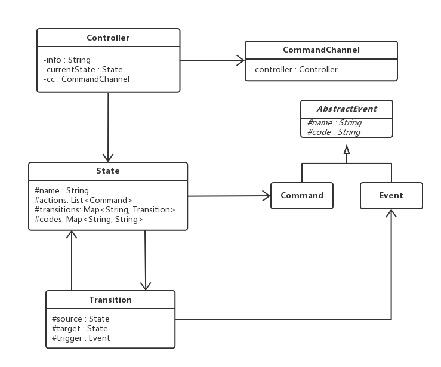

# finite-state-machine

## 0.目录
- [finite-state-machine](#finite-state-machine)
    - [0.目录](#0%E7%9B%AE%E5%BD%95)
    - [1. 需求背景](#1-%E9%9C%80%E6%B1%82%E8%83%8C%E6%99%AF)
    - [2. 状态机语言元模型](#2-%E7%8A%B6%E6%80%81%E6%9C%BA%E8%AF%AD%E8%A8%80%E5%85%83%E6%A8%A1%E5%9E%8B)
    - [3. 密室控制状态图](#3-%E5%AF%86%E5%AE%A4%E6%8E%A7%E5%88%B6%E7%8A%B6%E6%80%81%E5%9B%BE)
    - [4. 源码说明](#4-%E6%BA%90%E7%A0%81%E8%AF%B4%E6%98%8E)
        - [4.1 FSM语言编译器](#41-fsm%E8%AF%AD%E8%A8%80%E7%BC%96%E8%AF%91%E5%99%A8)
            - [4.1.1 FSM语法规则](#411-fsm%E8%AF%AD%E6%B3%95%E8%A7%84%E5%88%99)
            - [4.1.2 密室状态机](#412-%E5%AF%86%E5%AE%A4%E7%8A%B6%E6%80%81%E6%9C%BA)
            - [4.1.3 FSM语义分析](#413-fsm%E8%AF%AD%E4%B9%89%E5%88%86%E6%9E%90)
        - [4.2 状态机模型](#42-%E7%8A%B6%E6%80%81%E6%9C%BA%E6%A8%A1%E5%9E%8B)
            - [4.2.1 Event](#421-event)
            - [4.2.2 State](#422-state)
            - [4.2.3 Transition](#423-transition)
            - [4.2.4 数字控制面板GUI](#424-%E6%95%B0%E5%AD%97%E6%8E%A7%E5%88%B6%E9%9D%A2%E6%9D%BFgui)
        - [4.3 编译+运行](#43-%E7%BC%96%E8%AF%91%E8%BF%90%E8%A1%8C)
    - [5. 执行结果](#5-%E6%89%A7%E8%A1%8C%E7%BB%93%E6%9E%9C)
        - [5.1 Idle](#51-idle)
        - [5.2 密码输入](#52-%E5%AF%86%E7%A0%81%E8%BE%93%E5%85%A5)
        - [5.3 密码输入错误](#53-%E5%AF%86%E7%A0%81%E8%BE%93%E5%85%A5%E9%94%99%E8%AF%AF)
        - [5.4 密室打开](#54-%E5%AF%86%E5%AE%A4%E6%89%93%E5%BC%80)
        - [5.5 密室永久关闭](#55-%E5%AF%86%E5%AE%A4%E6%B0%B8%E4%B9%85%E5%85%B3%E9%97%AD)


## 1. 需求背景

参考Martin Fowler《领域特定语言》第一章的示例“格兰特小姐的密室”，用Java语言构造一个有限状态机语言，然后再利用该状态机语言构造一个密室控制系统。

具体要求如下：
1.	密室的控制使用数字控制面板，只有数字和确认键；
2.	密室打开的要求为输入自己的学号；
3.	画出该状态机语言的元模型；
4.	画出用该状态机语言构造的密室控制状态图；
5.	输入正确的学号按确认键，输出“密室打开”的信息；输入3次错误，则输入“密室永久封闭”的信息。


## 2. 状态机语言元模型

状态机语言元模型如下, 延用了《领域特定语言》中设计，并且稍作一些改动：




## 3. 密室控制状态图

密室控制状态图如下，完成需求功能，并且增加了重置功能以重新关上密室：


## 4. 源码说明

### 4.1 FSM语言编译器

构建外部DSL，基于Antlr实现语法解析，编写自己的语法规则**FSM.g4**，对**fsm**文件进行自顶向下的语义分析，生成控制器模型。

#### 4.1.1 FSM语法规则
```java
grammar FSM;

program: events commands states;

events: Events event+ End;

event: name code Semicolon;
name: ID;
code: ID;

commands: Commands command+ End;
command: name code Semicolon;

states: state+;

state: State name actions? transitions? End;
actions: Actions code+ Semicolon;
transitions: transition+;
transition: code Transition name Semicolon;

Transition: '=>';
State: 'state';
Events: 'events';
Commands: 'commands';
Actions: 'actions';
End: 'end';
Semicolon: ';';
ID: Char+;
```

> 大写变量声明词法, 小写变量声明语法，基于《领域特定语言》书中例子进行修改以增加可读性。

#### 4.1.2 密室状态机

```java
events
	151220136	DOOR_OPEN;
	reset	STATE_RESET;
	other	WRONG;
end

commands
	Please_Input_Password START_LOCK_DOOR;
	Wrong_Pass_Word_1 INC_WRONG_TIME_1;
	Wrong_Pass_Word_2 INC_WRONG_TIME_2;
	Room_Open UNLOCK_DOOR;
	Room_Lock_Forever LOCK_DOOR_FOREVER;
end

state idle
	actions START_LOCK_DOOR;
	DOOR_OPEN => unlockDoor;
	WRONG => wrongTime1;
	STATE_RESET => idle;
end

state wrongTime1
	actions INC_WRONG_TIME_1;
	DOOR_OPEN => unlockDoor;
	WRONG => wrongTime2;
	STATE_RESET => idle;
end

state wrongTime2
	actions INC_WRONG_TIME_2;
	DOOR_OPEN => unlockDoor;
	WRONG => lockDoorForever;
	STATE_RESET => idle;
end

state lockDoorForever
	actions LOCK_DOOR_FOREVER;
end 

state unlockDoor
	actions UNLOCK_DOOR;
	STATE_RESET => idle;
end

```

#### 4.1.3 FSM语义分析


**Visitor**为`Antlr`中对源程序进行自顶向下的语义分析的辅助类，此处继承**BaseVisitor**并编写了自己的语义分析，主要是构建了**符号表**与根据`idle`关键字标定初始状态**构造控制器**。


### 4.2 状态机模型

#### 4.2.1 Event

`Package Event`分为`AbstractEvent.java`，`Event.java`与`Command.java`。

```Java
public abstract class AbstractEvent {
    protected String name;
    protected String code;

    public AbstractEvent(String name, String code){
        this.name = name;
        this.code = code;
    }
    
    ...
}
```

> 由元模型图可知Command与Event均继承AbstractEvent只是从语义上区分两种类型，因此不再介绍。
> code是event的唯一标识符，name标识了事件应该执行的动作（反应在Command中name即为输出内容，Event中name为转换应满足的条件）


#### 4.2.2 State

`Package State`分为`Controller.java`与`State.java`，其中`State.java`内容与书上类似，不再赘述。

**Controller**的主要职责是从**CommandChannel**即信道中获取消息并进行状态转换并更新显示信息。


#### 4.2.3 Transition

`Package Transition`分为`Transition.java`与`CommandChannel.java`，其中`Transition.java`内容与书上类似，不再赘述。

**CommandChannel**即信道，负责获取输入信息，向控制器通知事件，向用户告知控制器信息。


#### 4.2.4 数字控制面板GUI

`Package GUI`为数字控制面板图形界面的类`PanelFrame.java`，继承`JFrame.java`。

GUI不用多说，就是注册时间，添加控件，与信道连接这些功能。


### 4.3 编译+运行

```java
public class Driver {
    public static void main(String[] args) throws Exception{
        String path = args.length == 1 ? args[0] : "/151220136.fsm";
        CharStream stream = CharStreams.fromStream(Driver.class.getResourceAsStream(path), Charset.forName("UTF-8"));
        FSMParser parser = new FSMParser(new CommonTokenStream(new FSMLexer(stream)));
        FSMControllerVisitor visitor = new FSMControllerVisitor();
        visitor.visitProgram(parser.program());
        Controller roomController = visitor.getController();
        PanelFrame frame = new PanelFrame(roomController.getCommandChannel());
    }
}
```

运行时分两步：

1. 对输入文件进行编译，生成控制器；
2. 显示数字控制面板，连接控制器信道，执行密室系统。

由Maven进行项目管理与自动化构建，可使用`mvn package`进行打包，运行时默认指定文件为`resources/151220136.fsm`，可通过main参数指定文件进行.fsm文件的编译。

## 5. 执行结果

执行时，先输入错误密码，再输入正确密码，最后重置关上密室并连续输入错误三次。

### 5.1 Idle


### 5.2 密码输入


### 5.3 密码输入错误


### 5.4 密室打开


### 5.5 密室永久关闭

